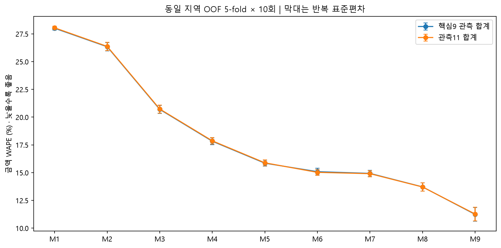
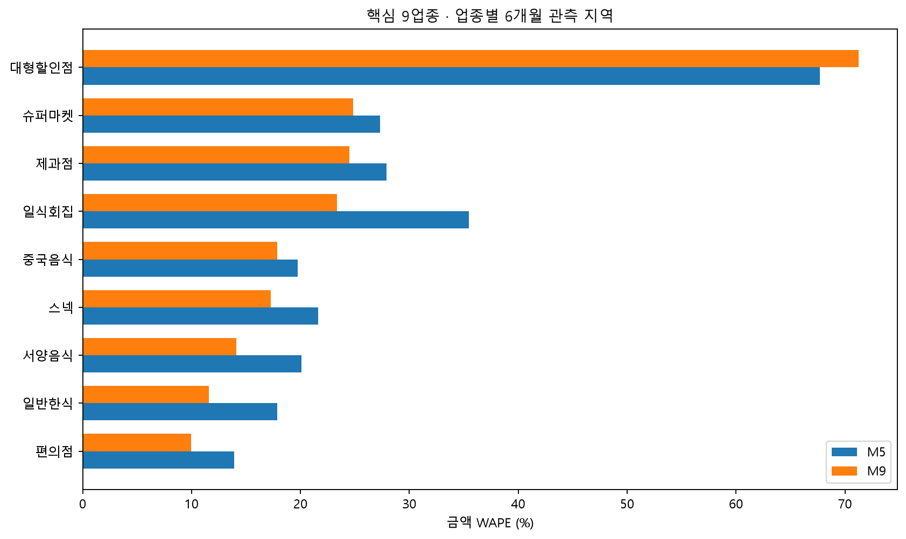
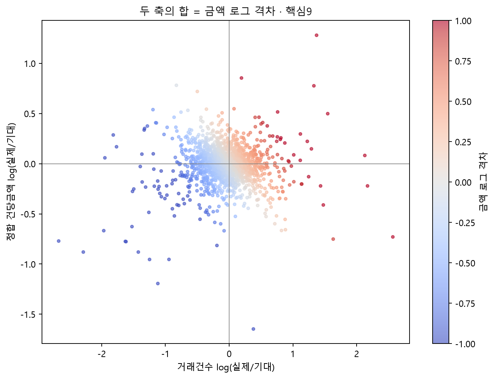
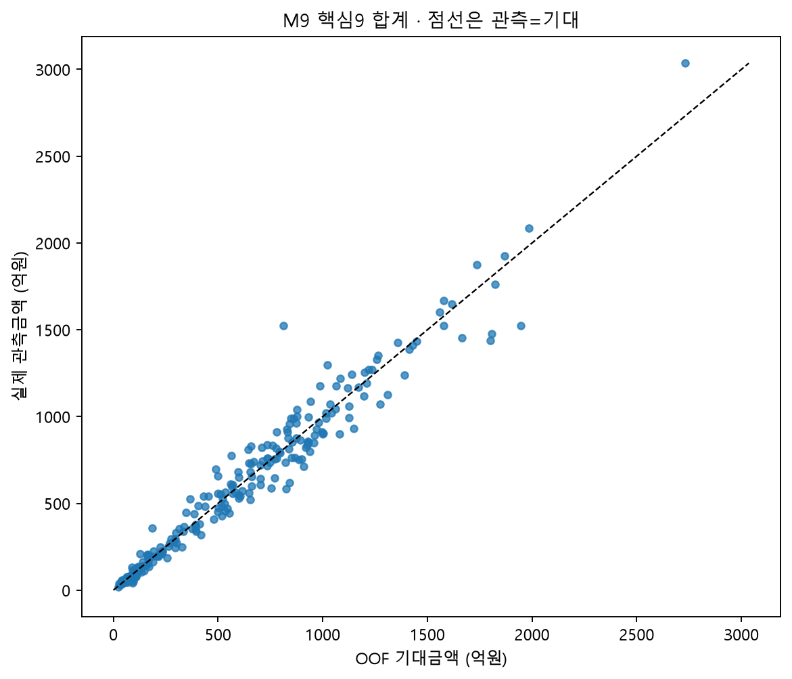
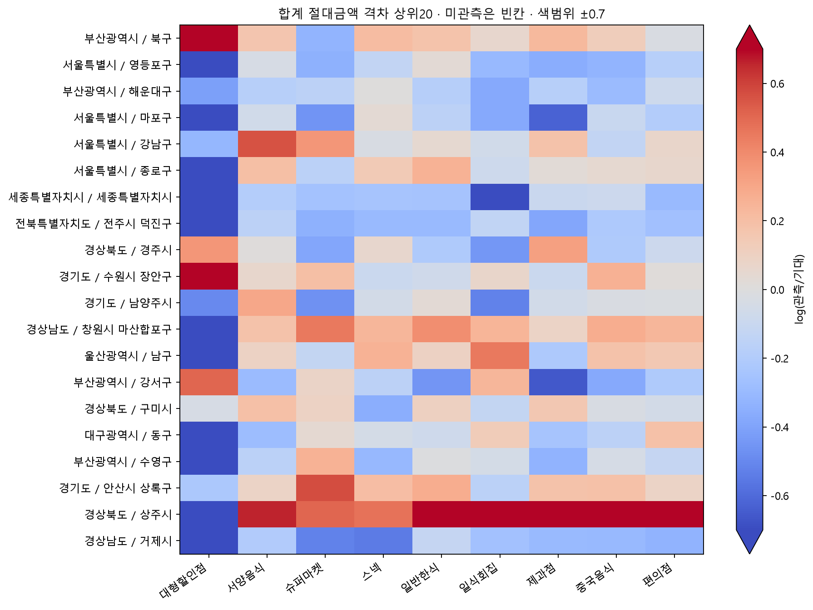

# BC 관측-기대 격차를 위한 구조적 기본모형

## 1. 새 변수를 넣으면 실제금액 오차가 얼마나 줄어드는가?

주 분석은 국내 개인(성별 1·2, 연령 1~6), 2026년 1~6월, 화성 신설4구 제외 251지역이다. **핵심9 관측 합계의 WAPE는 M5 15.85% → M9 11.24%**, 4.61pp 감소했다. 절대오차 합계의 상대 감소율은 29.09%, 지역당 MAE 변화는 26.93억원이다. 관측11 합계는 15.89% → 11.27%다.

| model | WAPE% | MAE(억원) | 원단위 R²% | 편향% | 반복 SD(pp) |
| --- | --- | --- | --- | --- | --- |
| M1 | 28.01 | 163.55 | 71.55 | 4.66 | 0.15 |
| M2 | 26.34 | 153.82 | 74.42 | 2.35 | 0.38 |
| M3 | 20.70 | 120.88 | 84.46 | 1.93 | 0.36 |
| M4 | 17.83 | 104.12 | 87.57 | 1.63 | 0.30 |
| M5 | 15.85 | 92.57 | 89.81 | 0.96 | 0.27 |
| M6 | 15.09 | 88.10 | 90.42 | 0.66 | 0.31 |
| M7 | 14.93 | 87.20 | 90.76 | 0.47 | 0.28 |
| M8 | 13.72 | 80.09 | 92.24 | 0.45 | 0.37 |
| M9 | 11.24 | 65.64 | 95.15 | 0.30 | 0.62 |

성능은 각 반복의 전체 OOF 점수를 평균했다. 잔차·산점도는 10회 OOF 기대금액 평균에 기초하므로 그 값으로 다시 계산한 WAPE와 표의 평균 WAPE는 다르다. 반복 SD·최소~최대는 표본추출 신뢰구간이나 유의성 검정이 아니다. 편향은 Σ(예측−실제)/Σ실제로 양수는 과대예측이다.

core9와 all11_observed 모두 **그 범위에서 관측된 금액만 합산**한다. 모든 지역에서 9업종이 전부 관측되었다는 뜻이 아니다. 미관측 0 대체는 하지 않았다. 개별 업종은 6개월 모두 관측된 지역만 사용하며 부분관측 제외 수를 커버리지 표에 남겼다. 합계는 실제 관측행에서 직접 계산하므로, 완전관측 지역만 남긴 개별업종 분석표의 합과 항상 같지는 않다.

## 2. 어떤 블록의 설명력이 컸는가?

| 블록 | 제외검증 WAPE 기여(pp) | 순차 WAPE 감소(pp) |
| --- | --- | --- |
| 면적·도시 형태 | 0.08 | 1.22 |
| 시도 공통효과 | 2.48 | 2.48 |
| 원천징수지 임금 | — | 0.04 |
| 점포 공급 | 0.22 | 0.77 |
| 주소지 구매력 | -0.17 | 0.15 |

최종모형에서 블록을 하나씩 제외했을 때 핵심9 금액 WAPE에 가장 큰 새 블록은 **시도 공통효과 (2.48pp)**였다. 양수는 해당 블록을 넣었을 때 개선, 음수는 악화다. 순차 증가분과 제외검증은 서로 다른 조건부 비교이며, 기여를 합쳐 총소비 비중이나 인과효과로 해석할 수 없다. 원천징수지 평균임금은 M9 이후 별도 보조 블록이다.

주소지 구매력의 최종모형 제외검증 기여는 -0.17pp다. 음수이므로 기존 구조정보와 중복되는 구매력 블록이 합계 금액 예측을 추가로 개선했다고 주장할 수 없다. 모든 구조변수를 포함한 사전 지정 M9를 기본모형으로 유지했고, 성능이 더 좋아 보이는 제외모형을 같은 OOF 결과로 골라 바꾸지 않았다.

M1 총인구, M2 연령5비율·여성·1/2인세대 비율, M3 사업체/종사자 규모, M4 도소매/숙박음식 사업체 비중 및 도소매/숙박음식/제조/전문과학기술 종사자 비중, M5 모바일 유입·유출이라는 기존 정의를 유지했다. 로그 모형의 M3는 인구대비 사업체/종사자, M5는 유입/인구와 유입/유출의 로그다. M1~M5의 raw Ridge와 로그 Ridge를 기존 결과와 수치 대조한다(`prior_M1_M5_reproduction.csv`).

기존 로그 피처는 **각 월 비율을 계산→6개월 평균→로그** 순서를 그대로 보존한다. 상반기 평균분자/평균분모로 바꾸지 않는다. 일반구 합산은 기존에 없던 별도 민감도이므로 합산한 반기 규모의 비율로 다시 계산한다.

M6는 업종별 점포/인구1만명의 log1p다. 합계 모형에는 해당9/11업종 공급 지표를 각각 넣어 공급 구성을 보존한다. M7은 주소지 평균급여 로그·신고인원/인구·상위시 공통값 플래그다. 일반구의 신고인원과 총액 및 신고인원/인구는 결측으로 두어 중복 배정하지 않는다. M8은 로그 인구밀도, 대·공장용지·농지임야 비중, 도시지역 면적/인구 비율, 주거·상업·공업 구성, 일반구 공통 플래그 및 행정구역 유형이다. 점포수·인구대비·면적대비를 동시에 넣지 않았다. 인구·사업체·종사자·전체/업종점포 밀도는 전처리표에 모두 보존한다.

M9는 SIDO_NM 지시변수다. 모든 계수에 같은 Ridge 벌점을 적용하므로 엄밀히는 **정규화한 시도 고정효과**다. 시도 효과는 BC 점유율·문화·가맹점 구성·누락변수 등을 흡수하며 원인별로 식별되지 않는다. 세종처럼 한 지역인 시도는 검증 fold에서 그 시도의 계수를 학습할 수 없으므로 미관측 범주로 예측한다. 전처리·결측 중앙값·표준화·범주 생성·smearing은 학습 fold에서만 계산한다. α=1을 사전 고정했으며 OOF에서 최적 모형을 선택하지 않았다. α=10을 별도 민감도로 평가했다. LOBO는 지정한 피처 블록을 제외하는 검증으로, 인구를 분모로 갖는 다른 블록까지 제거하는 인과적 변수 제거가 아니다.

## 3. 업종별 공급·구매력·밀도 효과

아래는 최종모형 제외검증의 금액 WAPE 기여(pp)다. 개별 계수의 부호나 인과적 수요탄력성이 아니다.

| industry | 점포 공급 | 주소지 구매력 | 면적·도시 형태 | 시도 공통효과 |
| --- | --- | --- | --- | --- |
| 대형할인점 | 1.72 | -0.14 | -4.53 | -4.18 |
| 서양음식 | 3.46 | -0.19 | -0.28 | 2.83 |
| 슈퍼마켓 | 0.71 | -0.17 | -0.65 | 2.44 |
| 스넥 | 0.35 | -0.08 | -0.53 | 2.89 |
| 일반한식 | 0.67 | -0.09 | -0.09 | 4.53 |
| 일식회집 | 12.20 | -0.18 | -1.03 | -0.19 |
| 제과점 | 0.69 | 0.03 | -0.27 | 0.97 |
| 중국음식 | 2.04 | 0.42 | -1.41 | 1.77 |
| 편의점 | 1.74 | -0.08 | -0.51 | 3.11 |

점포 공급 블록은 핵심9 중 9업종에서 WAPE를 개선했다. 가장 높은 기여는 일식회집 12.20pp, 가장 낮은 기여는 스넥 0.35pp다. 주소지 구매력 블록은 핵심9 중 2업종에서 WAPE를 개선했다. 가장 높은 기여는 중국음식 0.42pp, 가장 낮은 기여는 서양음식 -0.19pp다. 면적·도시 형태 블록은 핵심9 중 0업종에서 WAPE를 개선했다. 가장 높은 기여는 일반한식 -0.09pp, 가장 낮은 기여는 대형할인점 -4.53pp다. 시도 공통효과 블록은 핵심9 중 7업종에서 WAPE를 개선했다. 가장 높은 기여는 일반한식 4.53pp, 가장 낮은 기여는 대형할인점 -4.18pp다.

**대형할인점은 중요한 예외다.** M5→M9 금액 WAPE가 67.69%→71.25%로 악화했고 M9의 평균 과대예측은 20.57%다. α=10에서는 WAPE 58.20%로 달라져 정규화에도 민감하다. BC가6개월 관측된193지역 중 좁은 공급 정의의 점포수가0인 지역이 47개다. 따라서 이 업종의 큰 격차는 미설명 소비보다 공급분류·BC포착·모형부적합을 우선 점검해야 한다. 공급의 넓은 정의와 면적 추가만으로 이 문제를 해결했다고 볼 수 없다. 후보표에 모형 calibration 주의 플래그를 남겼다.

| industry | regions_any | regions_complete6 | partial_regions_excluded | coverage_status |
| --- | --- | --- | --- | --- |
| 대형할인점 | 194 | 193 | 1 | core |
| 편의점 | 251 | 251 | 0 | core |
| 슈퍼마켓 | 251 | 251 | 0 | core |
| 일반한식 | 251 | 251 | 0 | core |
| 갈비전문점 | 105 | 82 | 23 | exploratory |
| 한정식 | 39 | 16 | 23 | exploratory |
| 일식회집 | 248 | 239 | 9 | core |
| 중국음식 | 251 | 251 | 0 | core |
| 서양음식 | 251 | 251 | 0 | core |
| 스넥 | 251 | 251 | 0 | core |
| 제과점 | 251 | 250 | 1 | core |

한정식 16지역·갈비전문점 82지역은 별도 탐색 결과다. 소수 표본, 관측 선택 편향, 상호명 대리지표의 불완전성 때문에 핵심업종 순위에 포함하지 않았다. 전 업종 결과는 `industry_model_performance.csv`에 보존했다. 특히 대형할인점도 미관측 지역이 적지 않아 관측조건부 성능이다.

탐색 업종의 금액 성능(비율 열은 %):

| industry | model | n | wape | wape_min | wape_max | bias |
| --- | --- | --- | --- | --- | --- | --- |
| 갈비전문점 | M5 | 82 | 114.97 | 96.85 | 136.83 | 18.47 |
| 갈비전문점 | M9 | 82 | 119.71 | 88.30 | 230.50 | 26.64 |
| 한정식 | M5 | 16 | 243.37 | 115.56 | 669.41 | 103.07 |
| 한정식 | M9 | 16 | 115.01 | 78.90 | 211.28 | -9.75 |

## 4. 거래건수와 건당금액 중 어느 경로가 더 설명되는가?

| 종속변수 | M5 WAPE% | M9 WAPE% | 감소(pp) |
| --- | --- | --- | --- |
| 이용금액 | 15.85 | 11.24 | 4.61 |
| 거래건수 | 16.93 | 10.24 | 6.69 |
| 건당금액 | 8.34 | 7.95 | 0.39 |

업종별 경로는 다음의 최종모형 제외검증으로 비교한다. 단위는 각 종속변수의 WAPE 감소(pp)라서 건수와 객단가의 원단위 MAE를 직접 비교하지 않는다.

| industry | 블록 | 금액 | 건수 | 건당금액 |
| --- | --- | --- | --- | --- |
| 대형할인점 | 모바일 | -1.68 | -0.42 | -0.31 |
| 대형할인점 | 점포 공급 | 1.72 | 0.51 | 0.78 |
| 대형할인점 | 주소지 구매력 | -0.14 | -0.05 | 0.16 |
| 편의점 | 모바일 | -0.14 | 0.12 | 0.21 |
| 편의점 | 점포 공급 | 1.74 | 2.02 | -0.04 |
| 편의점 | 주소지 구매력 | -0.08 | -0.12 | -0.01 |
| 슈퍼마켓 | 모바일 | -0.34 | -0.23 | 0.15 |
| 슈퍼마켓 | 점포 공급 | 0.71 | 0.73 | -0.21 |
| 슈퍼마켓 | 주소지 구매력 | -0.17 | -0.34 | -0.14 |
| 일반한식 | 모바일 | 1.10 | 1.80 | 0.22 |
| 일반한식 | 점포 공급 | 0.67 | 1.20 | -0.02 |
| 일반한식 | 주소지 구매력 | -0.09 | 0.23 | -0.07 |
| 일식회집 | 모바일 | 0.01 | 0.23 | 0.05 |
| 일식회집 | 점포 공급 | 12.20 | 7.53 | 2.13 |
| 일식회집 | 주소지 구매력 | -0.18 | 0.01 | -0.20 |
| 중국음식 | 모바일 | 0.52 | 0.42 | 0.15 |
| 중국음식 | 점포 공급 | 2.04 | 1.53 | -0.03 |
| 중국음식 | 주소지 구매력 | 0.42 | -0.08 | 0.05 |
| 서양음식 | 모바일 | 1.22 | 1.22 | 0.10 |
| 서양음식 | 점포 공급 | 3.46 | 0.88 | 0.99 |
| 서양음식 | 주소지 구매력 | -0.19 | -0.49 | -0.05 |
| 스넥 | 모바일 | 0.88 | 2.22 | 0.24 |
| 스넥 | 점포 공급 | 0.35 | 0.61 | 0.21 |
| 스넥 | 주소지 구매력 | -0.08 | -0.32 | -0.17 |
| 제과점 | 모바일 | 0.22 | 0.13 | -0.10 |
| 제과점 | 점포 공급 | 0.69 | 0.47 | -0.02 |
| 제과점 | 주소지 구매력 | 0.03 | 0.15 | -0.06 |

모바일: 거래건수 개선 7/9업종, 독립 건당금액 개선 7/9업종. 각 업종별로 개선 부호가 다를 수 있어 단일 경로로 일반화하지 않는다. 점포 공급: 거래건수 개선 9/9업종, 독립 건당금액 개선 4/9업종. 각 업종별로 개선 부호가 다를 수 있어 단일 경로로 일반화하지 않는다. 주소지 구매력: 거래건수 개선 3/9업종, 독립 건당금액 개선 2/9업종. 각 업종별로 개선 부호가 다를 수 있어 단일 경로로 일반화하지 않는다.

금액·건수·객단가를 독립적으로 적합했다. 독립 예측 객단가×예측건수는 일반적으로 예측금액과 다르다. 잔차의 정확한 항등분해에는 정합 기대객단가=기대금액/기대건수를 사용해 log금액격차=log건수격차+log정합객단가격차를 만든다. 이 정합 객단가는 독립 객단가모형과 다른 지표다. `direct_ticket_identity_gap`에 두 방식의 불일치를 보존했다. 핵심9 지역×업종에서 |건수 로그격차|가 |정합객단가 로그격차| 이상인 비율은 74.2%다. 이는 오차의 회계적 분해이며 실제 소비자 수나 가격의 인과적 기여가 아니다.

## 5. 시도 공통효과 이후에도 지역 잔차가 남는가?

핵심9 합계 M9의 원단위 R²는 95.15%, 금액 WAPE 반복 범위는 10.35~12.03%다. 합계251지역 중 |log(실제/기대)|≥log(1.2)이면서 10회 중9회 이상 방향이 같은 지역은 56개다. 이 기준은 사전 진단 규칙이며 통계적 유의성을 의미하지 않는다. 낮은 쪽 임계값은 1/1.2≈0.833, 높은 쪽은 1.2로 로그 대칭이다.

표·그림의 값은 **BC 관측-기대 격차**다. 실제 지역 소비, BC 카드 사용 비중, 가맹점 포착, 누락변수, 자료집계·모형오차가 섞여 있다. 점선 위를 BC 이용강도가 높다거나 사업성이 좋다고 단정하지 않는다. 인구규모별·시도별 M5/M8/M9 calibration은 `calibration_by_population_and_sido.csv`에 모든 업종·종속변수에 대해 저장했다.

반복평균 예측의 인구규모별 calibration:

| group | n | WAPE% | 편향% |
| --- | --- | --- | --- |
| <5만 | 58 | 17.81 | 0.16 |
| 5–15만 | 58 | 13.43 | -0.85 |
| 15–30만 | 72 | 11.80 | -0.80 |
| 30만+ | 63 | 8.72 | 1.36 |

시도별 절대편향이 큰5개 그룹(지역수가 작으면 해석에 특히 주의):

| group | n | WAPE% | 편향% |
| --- | --- | --- | --- |
| 세종특별자치시 | 1 | 41.65 | 41.65 |
| 전북특별자치도 | 15 | 14.55 | 8.33 |
| 울산광역시 | 5 | 10.77 | 4.31 |
| 충청남도 | 16 | 11.09 | -4.25 |
| 경상북도 | 23 | 16.04 | -2.31 |

## 6. 지역 공통형과 업종 특이형

지역 공통형은 관측 핵심업종이6개 이상이고, 업종 로그격차 중앙값의 절대값≥log(1.2), 같은 방향 업종≥75%인 경우다. 업종 특이형은 공통형 이외에서 업종 로그격차−지역 중앙값의 절대값≥log(1.2)인 경우다. 따라서 이 분류는 통계적 잠재요인 추정이 아닌 해석용 진단이다.

지역 공통형은 251지역 중 43개다. 안정적인 핵심9 지역×업종 격차 978건의 구성은 업종 특이형 541건, 지역 공통형 276건, 혼합/작은 격차 161건이다. 업종별 절대금액오차 합에서 한 업종이50% 이상 차지하는 지역은 80개다. 이 비중은 직접 적합한 합계모형의 잔차 기여율이 아니라 개별업종 모형 오차 집중도다. 업종 공통 방향과 특정 대형업종의 금액 지배를 구분해야 한다.

합계모형과 업종모형이 독립 적합되므로 잔차의 단순합도 항상 같지는 않다. `region_residual_structure.csv`에는 **합계잔차=개별업종잔차합+부분관측업종금액+(개별업종기대합−합계모형기대)**의 정합 분해를 함께 보존한다. 부분관측과 모형 간 합계 차이를 특정 업종의 기여로 오인하지 않는다.

## 7. 추가 외부데이터 실험 가치가 있는 곳

아래는 핵심9 중 반복 방향≥90%, 격차크기 기준을 통과하고, 공급의 넓은 정의·α=10·원천징수지 추가·상위시 그룹CV에서도 방향이 유지되는 947건 중 절대금액격차 상위15건이다. 유의확률·다중검정으로 확정한 이상지역이 아니며 사업대상 추천도 아니다.

| region | industry | ratio_amt | direction_stability | dominant_component | residual_type | 실제-기대(억원) |
| --- | --- | --- | --- | --- | --- | --- |
| 울산광역시 / 남구 | 대형할인점 | 0.09 | 1.00 | 거래건수 | 업종 특이형 | -1,107.19 |
| 부산광역시 / 북구 | 대형할인점 | 9.11 | 1.00 | 거래건수 | 업종 특이형 | 685.36 |
| 서울특별시 / 강남구 | 서양음식 | 1.76 | 1.00 | 거래건수 | 업종 특이형 | 396.01 |
| 서울특별시 / 영등포구 | 대형할인점 | 0.29 | 1.00 | 거래건수 | 지역 공통형 | -362.64 |
| 제주특별자치도 / 제주시 | 대형할인점 | 0.21 | 1.00 | 거래건수 | 업종 특이형 | -278.73 |
| 경기도 / 평택시 | 대형할인점 | 0.26 | 1.00 | 거래건수 | 업종 특이형 | -259.65 |
| 경기도 / 여주시 | 대형할인점 | 14.16 | 1.00 | 거래건수 | 업종 특이형 | 253.23 |
| 세종특별자치시 / 세종특별자치시 | 대형할인점 | 0.10 | 1.00 | 건당금액 | 지역 공통형 | -237.83 |
| 인천광역시 / 중구 | 대형할인점 | 0.17 | 1.00 | 거래건수 | 업종 특이형 | -204.49 |
| 경기도 / 수원시 장안구 | 대형할인점 | 4.11 | 1.00 | 거래건수 | 업종 특이형 | 183.44 |
| 전라남도 / 여수시 | 대형할인점 | 0.25 | 1.00 | 거래건수 | 업종 특이형 | -168.74 |
| 서울특별시 / 구로구 | 대형할인점 | 0.44 | 1.00 | 거래건수 | 업종 특이형 | -162.80 |
| 경기도 / 고양시 덕양구 | 대형할인점 | 2.06 | 1.00 | 거래건수 | 업종 특이형 | 157.19 |
| 부산광역시 / 강서구 | 일반한식 | 0.64 | 1.00 | 거래건수 | 업종 특이형 | -145.30 |
| 대구광역시 / 동구 | 대형할인점 | 0.30 | 1.00 | 거래건수 | 업종 특이형 | -142.91 |

지역 공통형은 BC 가맹점 포착과 공통 누락요인을 먼저 확인한다. 업종 특이형이면서 건수 중심인 후보에서는 점포 누락을 확인한 뒤, 해당 업종의 검색 관심도가 **거래건수 OOF 오차를 줄이는지** 실험할 가치가 있다. 건당금액 중심은 상품·가격·점포구성이 우선이며 검색량과의 연결 근거는 약하다. 후보별 실험 문구는 `residual_candidates.csv`에 있다. 이번 분석에는 검색량·관광·축제 자료를 결합하지 않았고 그 데이터의 추가 설명력도 검증하지 않았다.

음식업 중 업종 특이형·건수 중심·대안모형 방향안정 조건을 만족한 검색량 실험 후보 예시는 다음과 같다. 종속변수는 거래건수다. 잔차가 존재한다는 사실만으로 검색량이 설명할 것이라고 결론 내리지 않는다.

| region | industry | ratio_amt | ratio_cnt | direction_stability |
| --- | --- | --- | --- | --- |
| 서울특별시 / 강남구 | 서양음식 | 1.76 | 2.32 | 1.00 |
| 부산광역시 / 강서구 | 일반한식 | 0.64 | 0.66 | 1.00 |
| 부산광역시 / 동래구 | 일반한식 | 1.27 | 1.22 | 1.00 |
| 대전광역시 / 중구 | 제과점 | 8.20 | 3.77 | 1.00 |
| 인천광역시 / 연수구 | 일반한식 | 1.31 | 1.15 | 1.00 |
| 서울특별시 / 용산구 | 중국음식 | 3.36 | 4.19 | 1.00 |
| 강원특별자치도 / 속초시 | 일반한식 | 1.33 | 1.43 | 1.00 |
| 제주특별자치도 / 제주시 | 서양음식 | 0.78 | 0.81 | 1.00 |

## 8. 민감도와 현재 주장할 수 없는 것

| scenario | model | n | wape | wape_min | wape_max | bias |
| --- | --- | --- | --- | --- | --- | --- |
| general_gu_aggregate | M5 | 228 | 16.13 | 15.14 | 17.05 | 1.49 |
| general_gu_aggregate | M9 | 228 | 11.45 | 10.21 | 12.54 | 0.17 |
| hwaseong_aggregate | M5 | 252 | 15.80 | 15.47 | 16.14 | 0.87 |
| hwaseong_aggregate | M9 | 252 | 11.63 | 10.86 | 12.61 | 0.51 |
| main | M9 | 251 | 11.24 | 10.35 | 12.03 | 0.30 |
| main | M9_alpha10 | 251 | 14.30 | 13.46 | 14.80 | -2.30 |
| main | M9_broad_supply | 251 | 11.02 | 10.15 | 11.89 | 0.33 |
| main | M9_current_stores | 251 | 11.23 | 10.32 | 12.01 | 0.30 |
| main | M9_mall_area | 251 | 11.01 | 10.45 | 12.09 | 0.40 |
| main | M9_taxable_pay | 251 | 11.24 | 10.34 | 12.03 | 0.30 |
| main | M9_workplace | 251 | 11.20 | 10.41 | 12.02 | 0.24 |
| parent_group_cv | M5 | 251 | 15.79 | 15.15 | 16.27 | 0.97 |
| parent_group_cv | M9 | 251 | 11.56 | 10.93 | 12.27 | 0.36 |

화성 통합은252지역, 일반구 상위시 합산은 화성을 제외한 별도 단위다. 일반구 합산은 인구·금액·건수·사업체·종사자·면적·점포수를 합산하고 비율을 재계산했다. 모바일은 구간 이동을 합산하므로 내부 구간 이동을 제거할 수 없다는 한계가 있다. 같은 일반구 자료를 유지하되 상위시 전체를 한 fold로 묶는 `parent_group_cv`도 수행했다. main과 민감도는 각 시나리오 안에서 동일 fold를 사용하며, 서로 다른 지역단위의 WAPE는 동일 표본 성능으로 취급하지 않는다.

원단위 raw Ridge는 비교용으로만 보존했다. 그 음수 예측을 0으로 바꾸거나 잔차 후보에 섞지 않았다. 현재 자료는 2024소득/도시계획, 2025지적면적, 2026년3월 상가단면과 2026상반기 소비를 결합한다. 동시기 설명 비교이며 실시간 예측·미래예측 검증이 아니다. 사업체 조사 기준연도와 모바일 주차값의 일평균 여부는 기존 자료에서 확정되지 않았다.

주민 구매력은 근로소득 신고자 평균의 대리변수이며 자영업·재산소득·미신고자·가구재산을 포함하는 전체 가처분소득이 아니다. 일반구 평균급여·도시형태는 상위시 공통값이므로 구간 차이의 정밀한 설명으로 해석하지 않는다. 도시 고시면적은 물/해역 등을 포함할 수 있고, 도시인구2024/주민인구2026의 분모연도도 달라 비율이1을 넘을 수 있다. 자의적으로1로 자르지 않았다.

상가 업종 분류와 BC 업종은 공식 일대일 대응이 아니며, 특히 한정식·갈비는 상호명 대리지표다. 대형점포 자료는 실제 일별 영업·BC 가맹 여부를 증명하지 못한다. 현재 모형으로 BC 시장점유율, 전체 카드시장 매출, 진짜 과소/과대소비, 관광·검색의 인과효과, 사업성과를 주장할 수 없다. 잔차는 추가 검증의 출발점이다.

실행: `python -X utf8 analysis/structural_baseline_model/run_analysis.py --rebuild`. 재검증: `python -X utf8 analysis/structural_baseline_model/validate_outputs.py`. 원본 보존 결과는 `tables/protected_file_hashes.csv`, 독립 검증은 `tables/validation_checks.csv`, 모든 파일 해시는 `artifact_manifest.csv`다.
